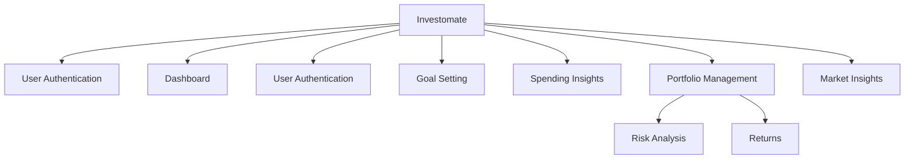

# InvestoMate

InvestoMate is an AI-driven personal wealth management platform that provides portfolio management, smart spending insights, and investment recommendations. The platform combines a robust React-based front-end with a Python-powered back-end to deliver personalized financial insights and actionable investment recommendations.

## Table of Contents

- [Overview](#overview)
- [Features](#features)
- [Repository Information](#repository-information)
- [Prerequisites](#prerequisites)
- [Installation](#installation)
  - [Front-End Setup](#front-end-setup)
  - [Back-End Setup](#back-end-setup)
- [Configuration](#configuration)
- [Running the Application](#running-the-application)
  - [Development](#development)
  - [Production Build](#production-build)
- [UI Previews](#ui-previews)
- [Application Flowcharts](#application-flowcharts)
- [Troubleshooting](#troubleshooting)

## Overview

InvestoMate leverages state-of-the-art AI to help users manage their personal wealth efficiently. Key functionalities include:
- **Portfolio Management:** Monitor and manage your assets with real-time data and historical analytics.
- **Smart Spending Insights:** Analyze your spending habits, categorize your expenses, and receive personalized recommendations.
- **Investment Recommendations:** Receive AI-driven insights and predictive analysis to support smarter investment decisions.

## Features

- **User Onboarding & Authentication:** Secure and scalable user registration, login, and session management.
- **Expense Optimization:** Automated classification of expenses into Needs, Wants, and Savings along with optimization strategies.
- **AI-Driven Insights:** Utilize machine learning models (e.g., LSTM for prediction, sentiment analysis) and integrate with third-party AI services to generate investment recommendations.
- **Real-time Market Data:** Seamless integration with financial data APIs to provide up-to-date market information.

## Repository Information

This repository is actively maintained on GitHub:
- **Repository:** [its-dhanya/investomate](https://github.com/its-dhanya/investomate)
- **Stars, Forks, and Issues:** For up-to-date repository statistics and issues, please visit the GitHub repository page.
- **Latest Commit:** Check the [commit history](https://github.com/its-dhanya/investomate/commits/main) for recent updates and improvements.

## Prerequisites

- [Node.js](https://nodejs.org/) (LTS version recommended)
- [npm](https://www.npmjs.com/) (usually installed with Node.js)
- [Python](https://www.python.org/) (version 3.8+ recommended)
- Git

## Installation

### Front-End Setup

1. **Clone the Repository**

   Open your terminal and run:
   ```bash
   git clone https://github.com/its-dhanya/investomate.git
   ```

2. **Navigate to the Project Directory**

   ```bash
   cd investomate
   ```

3. **Install Front-End Dependencies**

   Install the required npm packages:
   ```bash
   npm install
   ```

### Back-End Setup

If the back-end service is located in a separate directory (e.g., `backend`):

1. **Navigate to the Back-End Directory**

   ```bash
   cd backend
   ```

2. **Install Back-End Dependencies**

   Install the required Python packages:
   ```bash
   pip install -r requirements.txt
   ```

## Configuration

### Environment Variables

Create a `.env` file in the root directory (or in the back-end directory if applicable) to store environment-specific variables. For example:
```bash
cp .env.example .env
```
Update the `.env` file with:
- `GEMINI_API_KEY` – API key for AI-driven investment insights.
- Other API keys or configuration variables as required.

## Running the Application

### Development

#### Front-End

Start the development server (default port is **5173**):
```bash
npm run dev
```
Visit the application at:
```
http://localhost:5173
```

#### Back-End

Run the Python service (assuming it listens on port **5001**):
```bash
python script.py
```
Ensure the back-end service is running so that the front-end can fetch optimization and recommendation data.

### Production Build

To generate a production build:
```bash
npm run build
```
To preview the production build locally:
```bash
npm run preview
```

## UI Previews

Below are screenshots showcasing different UI sections of InvestoMate:

### **Dashboard Preview**


### **Signup Page**


### **Goal setting**


### **Portfolio Management UI**


### **Simulation**


### **Investment Insights**


## **Flow Chart**



## Troubleshooting

- **Node.js Version:** Ensure you’re running a compatible Node.js version (use `node -v`).
- **Environment Variables:** Verify that the `.env` file is correctly configured.
- **API Connectivity:** Confirm that the Python back-end service is running to prevent API errors on the front-end.
- **Error Logs:** Check terminal and browser console logs for troubleshooting hints.

---

